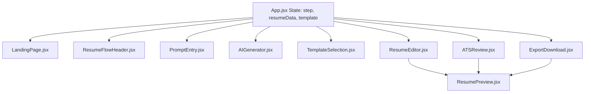

# Implementation Plan - Prompt Resume End-to-End Product Flow

This plan outlines the architecture, components, and user experience flow for the **Prompt Resume** builder journey, transitioning users from the Landing Page into a premium, interactive AI-assisted resume-building flow.

---

## User Review Required

> [!IMPORTANT]
> **Key Architecture Decisions:**
> 1. **Step Management**: We will manage the active page inside `App.jsx` using a single state variable `step` (options: `'landing'`, `'prompt'`, `'generating'`, `'templates'`, `'editor'`, `'ats'`, `'export'`).
> 2. **Data Persistence**: Resume data and chosen template will be stored in React state at the `App.jsx` level, ensuring they persist as the user navigates between steps.
> 3. **Dynamic Template Preview**: We will implement a high-fidelity `ResumePreview` component that renders the actual content in four visual styles (`Meridian`, `Ashford`, `Luma`, `Pulse`) matching the landing page description.
> 4. **AI simulation**: The AI generation and improvement actions (like "Improve Wording" and "ATS Auto-fix") will use animated mock processes (such as simulated extraction and typewriter text effects) to make the experience feel reactive and alive.

---

## Proposed Changes

We will introduce a clean navigation framework, mock data schemas, and the 6 functional states.

### Component Architecture Diagram

---

### [Component Name] Shared Components & Setup

#### [NEW] [mockResumeData.js](file:///d:/Project/Resume%20updated/src/data/mockResumeData.js)
Provides rich mock data matching the three example prompts (Experienced Pro, Career Switcher, Fresh Graduate) so that the user gets high-quality resume content upon prompting.

#### [NEW] [ResumeFlowHeader.jsx](file:///d:/Project/Resume%20updated/src/components/ResumeFlowHeader.jsx)
A premium top navigation bar displayed during the flow. It features:
- Stepper: `1. Prompt` → `2. Gallery` → `3. Editor` → `4. ATS Score` → `5. Export`.
- Active, completed, and pending indicator styles.
- "Save Draft" autosave indicators.
- A "Back to landing" button.

#### [NEW] [ResumePreview.jsx](file:///d:/Project/Resume%20updated/src/components/ResumePreview.jsx)
A reusable high-fidelity document visualizer that applies specific styling based on the selected template:
- **Meridian**: Modern, clean, teal accents, DM Sans typography.
- **Ashford**: Executive, classic centered header, DM Serif Display headings.
- **Luma**: Minimalist, high data-density, compact formatting, neutral accents.
- **Pulse**: Technical, two-column layout with sidebar, navy blue accents.

---

### [Component Name] Step Components

#### [NEW] [PromptEntry.jsx](file:///d:/Project/Resume%20updated/src/components/PromptEntry.jsx)
The starting point for the builder.
- Conversational chat-style layout with a prominent teal-focused prompt box.
- Sidebar list of recommended sections (contact, skills, etc.) to prompt completeness.
- Three clickable, fully-editable example cards (Experienced, Career Switcher, Fresher).
- CTAs: "✦ Generate Resume" (Primary) and "Start manually" (Secondary).
- Trust indicators (ATS-friendly, editable later).

#### [NEW] [AIGenerator.jsx](file:///d:/Project/Resume%20updated/src/components/AIGenerator.jsx)
An engaging intermediate loading state.
- Simulates a 5-step AI extraction progress with checkmark reveals and micro-animations:
  1. *Reading your background...*
  2. *Structuring resume sections...*
  3. *Optimizing wording...*
  4. *Applying ATS formatting...*
  5. *Preparing template-ready content...*
- Progress bar and stats cards showing "Extracting key terms..." and "Formatting sections...".

#### [NEW] [TemplateSelection.jsx](file:///d:/Project/Resume%20updated/src/components/TemplateSelection.jsx)
The visual template gallery.
- Interactive grid of the 4 templates with style tags and descriptions.
- Dynamic preview (renders actual user details in miniature).
- CTA: "Use This Template →".

#### [NEW] [ResumeEditor.jsx](file:///d:/Project/Resume%20updated/src/components/ResumeEditor.jsx)
The core workspace.
- **Left Panel (Fields Editor)**: Tabbed layout for Personal Info, Summary, Experience, Education, Skills, and Projects. Inline editing triggers live updates.
- **AI Assist buttons**: For each text block, include: "✦ Improve", "✦ Shorten", "✦ Make Professional". Clicking triggers a typing loader and replaces text.
- **Right Panel (Preview)**: Scrollable, responsive A4 resume preview sheet.
- **Footer Navigation**: "← Templates" | "Next: Check ATS Score →".

#### [NEW] [ATSReview.jsx](file:///d:/Project/Resume%20updated/src/components/ATSReview.jsx)
The recruiter-readiness scoring screen.
- Circular dynamic gauge showing the ATS score (e.g. 84/100).
- Category breakdowns (Keywords, Formatting, Readability, Length).
- Actionable checklist with "Quick Fix" buttons to automatically optimize summaries or inject keywords.
- Split screen showing the live document in real-time.

#### [NEW] [ExportDownload.jsx](file:///d:/Project/Resume%20updated/src/components/ExportDownload.jsx)
The export checkout dashboard.
- Display finished document in a beautiful "success" setting.
- Action items: Download PDF (Teal primary), Download DOCX (Amber secondary), Copy Plain Text, Share link.
- Reassurance microcopy regarding ATS parsing and career readiness.

---

### [Component Name] Landing Page Integration

#### [MODIFY] [App.jsx](file:///d:/Project/Resume%20updated/src/App.jsx)
Update `App.jsx` to:
1. Import all new flow components.
2. Initialize state for `step`, `resumeData`, and `selectedTemplate`.
3. Provide conditional rendering based on the active `step`.

#### [MODIFY] [LandingPage.jsx](file:///d:/Project/Resume%20updated/src/LandingPage.jsx)
Pass the `onBuildResume` callback to internal CTA elements:
- `Navbar` ("Start free" button)
- `Hero` ("Build my resume" and AI prompt button)
- `Templates` (clicking any template preview starts the flow directly with that template preselected)
- `FinalCTA` ("Build my resume — it's free")

---

## Verification Plan

### Automated / Browser-based Verification
We will run and verify the React Vite app on `http://localhost:5173/` using the browser subagent.
We will inspect:
1. Landing page CTA clicks to ensure they open the Prompt Entry Page.
2. Example prompts to verify clicking them populates the text area.
3. Submit action to verify the 4-second loading state and transition to Template Gallery.
4. Template card hover states and selection transitions to the Resume Editor.
5. In-editor field inputs to check if they reflect instantly in the document preview.
6. AI helper actions (e.g. "Improve") to verify typewriter simulation.
7. ATS Score calculations and suggestion cards.
8. Download buttons and file export alerts.

### Manual Verification
- Verify layout responsiveness (mobile drawer vs. desktop split-pane) in the browser subagent.
- Ensure the color tokens align perfectly with the theme defined in `globals.css` (soft teal gradients, ivory base, amber highlight).
